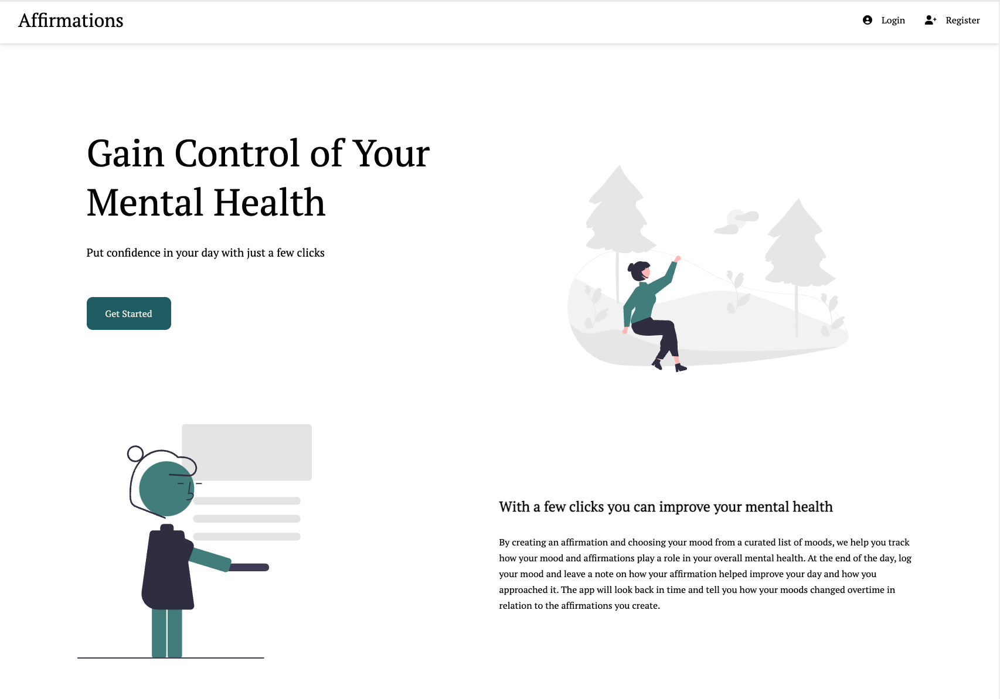

## Affirmations

### Deploy Status

**See deployed app [here](https://www.affirmations.life/)**

## About the App

Affirmation is an application that let's you create daily affirmations of positivity and inspiration to put you in a positive headspace. Simply create an affirmation when you wake up and manifest it into your daily life. When you head in for the evening, log your current mood and leave a note on how you feel as well as anything else on your mind. Through date & time indexing and the mood-meter, get a glimpse back in time to see how your mood and affirmations played a role in your everyday happiness. Having a bad day? Not to worry, we will generate an affirmation for you if your mood is neutral or worse so that you can get into a positive headspace and get the help you need to get on track.

Affirmations mission is to help you gain self confidence, improve how you tackle and improve your mental health and foster the ability to think and learn from your past to improve your future.

### App Architecture

